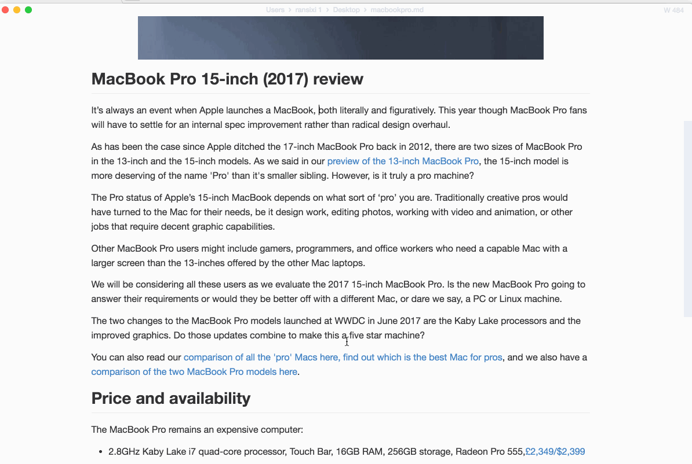

<p align="center"></p>

<h1 align="center">MarkDown++</h1>

<div align="center">
  <strong>下一代 Markdown 编辑器</strong><br>
  基于 <a href="https://github.com/marktext/marktext">MarkText</a> 的增强分支，提供 ZRead 阅读模式、分屏预览、多语言支持和 AI 智能编辑。<br>
  <sub>支持 Linux、macOS 和 Windows。</sub>
</div>

<br>

<div align="center">
  <!-- License -->
  <a href="LICENSE">
    
  </a>
  <!-- Downloads total -->
  <a href="https://github.com/nlstone/Markdown-PlusPlus/releases">
    
  </a>
  <!-- Downloads latest release -->
  <a href="https://github.com/nlstone/Markdown-PlusPlus/releases/latest">
    
  </a>
  <!-- Language -->
  <a href="README.md">English</a> | <a href="README_zh-CN.md">中文</a>
</div>

<div align="center">
  <h3>
    <a href="#功能特性">功能特性</a>
    <span> | </span>
    <a href="#下载安装">下载安装</a>
    <span> | </span>
    <a href="#开发构建">开发构建</a>
    <span> | </span>
    <a href="#参与贡献">参与贡献</a>
  </h3>
</div>

<br />

## 关于

**MarkDown++** 是 [MarkText](https://github.com/marktext/marktext) 的增强分支，在 MarkText 的基础上增加了阅读、写作和 AI 辅助编辑等重大改进。MarkText 是一款 MIT 许可的开源 Markdown 编辑器。

## 功能特性

### 继承自 MarkText

- **实时预览 (WYSIWYG)** — 简洁清晰的界面，沉浸式写作体验。
- **CommonMark & GFM 支持** — 完整支持 [CommonMark 规范](https://spec.commonmark.org/0.29/) 和 [GitHub Flavored Markdown](https://github.github.com/gfm/)，以及部分 [Pandoc Markdown](https://pandoc.org/MANUAL.html#pandocs-markdown) 语法。
- **Markdown 扩展** — 数学公式 (KaTeX)、YAML 前置信息、Emoji、图表 (Mermaid、PlantUML、Vega)。
- **导出格式** — 导出为 **HTML** 和 **PDF**。
- **主题** — 内置多款主题：Cadmium Light、Material Dark、Graphite、One Dark 等。
- **编辑模式** — 源代码模式、打字机模式、专注模式。
- **剪贴板图片** — 直接从剪贴板粘贴图片。
- **图片上传** — 将图片上传到云服务 (GitHub、Imgur 等)。

### MarkDown++ 新增功能

#### :book: ZRead 阅读模式

专为 [ZRead](https://github.com/nlstone/zread) 生成的文档优化的阅读模式。提供沉浸式、无干扰的阅读体验，排版和布局经过优化。非常适合长篇技术文档、文章和转换内容的阅读。

#### :left_right_arrow: 实时分屏预览

Markdown 源码和渲染结果并排实时预览。一侧编辑，另一侧即时看到变化 — 兼顾源代码编辑和所见即所得两全其美。支持源代码预览中的专注和打字机模式。

#### :globe_with_meridians: 多语言支持 (国际化)

完整的应用界面国际化支持：
- :cn: 简体中文
- :us: English

*更多语言即将支持 — 欢迎贡献翻译！*

#### :robot: AI 智能编辑

集成 AI 助手，提供智能写作辅助：
- **智能改写** — AI 驱动的内容改写和重构
- **AI 助手** — 基于上下文的建议、摘要和扩展
- **行内 AI** — 编辑器内快速 AI 操作

<h4 align="center">:crescent_moon: 主题 :high_brightness:</h4>

| Cadmium Light                                     | Dark                                            |
|:-------------------------------------------------:|:-----------------------------------------------:|
|   |          |
| Graphite Light                                    | Material Dark                                   |
|  |  |
| Ulysses Light                                     | One Dark                                        |
|   |      |

<h4 align="center">:smile_cat: 编辑模式 :dog:</h4>

| 源代码模式          | 打字机模式               | 专注模式               |
|:--------------------:|:------------------------:|:-------------------:|
|  |  |  |

## 截图


*MarkDown++ 提供 ZRead 沉浸式阅读模式和分屏实时预览功能。*

## 下载安装

### Windows（推荐）

从 [发布页面](https://github.com/nlstone/Markdown-PlusPlus/releases/latest) 下载：

- **安装版**（`markdownpp-setup.exe`）— 推荐。包含右键菜单"Open with MarkDown++"和 `.md` 文件打开方式注册。
- **免安装版**（`markdownpp-portable.exe`）— 无需安装，直接运行。

> Windows 是目前主要测试和验证的平台。其他操作系统的安装包暂未提供，可自行从源码构建（参见[开发构建](#开发构建)）。

### macOS & Linux

暂无预构建安装包。如需在 macOS 或 Linux 上使用 MarkDown++，请从源码构建：

```bash
git clone https://github.com/nlstone/Markdown-PlusPlus.git
cd Markdown-PlusPlus
yarn install
yarn dev        # 开发模式运行
yarn build      # 生产构建
```

详细环境要求请参阅[构建说明](docs/dev/BUILD.md)。

## 开发构建

如需自行构建 MarkDown++，请查看 [构建说明](docs/dev/BUILD.md)。

### 环境要求

- **Node.js**: >= v16 且 < v17（严格的版本要求）
- **Yarn**: v1.x (classic)
- **Python**: 用于原生模块编译 (`node-gyp`)
- **C++ 编译器**：各平台要求不同（Windows: Visual Studio Build Tools, macOS: Xcode CLI, Linux: gcc/g++）

### 快速开始

```bash
# 安装依赖
yarn install

# 启动开发服务器（热重载）
yarn dev

# 代码检查
yarn lint

# 运行测试
yarn test
```

详细构建和开发说明：

- [用户文档](docs/README.md)
- [开发者文档](docs/dev/README.md)
- [架构概览](docs/dev/ARCHITECTURE.md)

## 快捷键

MarkDown++ 支持丰富的键盘快捷键，完整列表请参考 [快捷键说明](docs/KEYBINDINGS.md)。

| 快捷键 | 功能 |
|--------|------|
| `Ctrl+S` / `Cmd+S` | 保存 |
| `Ctrl+Shift+S` / `Cmd+Shift+S` | 另存为 |
| `Ctrl+P` / `Cmd+P` | 快速打开 |
| `Ctrl+F` / `Cmd+F` | 查找 |
| `Ctrl+H` / `Cmd+Alt+F` | 替换 |
| `Ctrl+/` / `Cmd+/` | 切换源代码模式 |
| `Ctrl+Shift+P` / `Cmd+Shift+P` | 命令面板 |

## 参与贡献

MarkDown++ 正在积极开发中，欢迎社区贡献！

- **Bug 报告**：[提交问题](https://github.com/nlstone/Markdown-PlusPlus/issues/new?template=bug_report.md)
- **功能建议**：[提交建议](https://github.com/nlstone/Markdown-PlusPlus/issues/new?template=feature_request.md)
- **Pull Request**：请提交到 `dev` 分支

提交 PR 前请阅读 [贡献指南](CONTRIBUTING.md)。

## 许可证

MarkDown++ 采用双重许可协议：

- **MIT 许可证** — 适用于个人使用、开源项目、教育和非商业用途。详见 [LICENSE](LICENSE)。
- **商用许可证** — 用于商业 SaaS、闭源再分发、OEM 嵌入等商业用途时需另行授权。详见 [COMMERCIAL_LICENSE.md](COMMERCIAL_LICENSE.md)。

MarkDown++ 基于 [MarkText](https://github.com/marktext/marktext) 开发，MarkText 版权所有 (c) 2017-present Luo Ran，遵循 MIT 许可证。