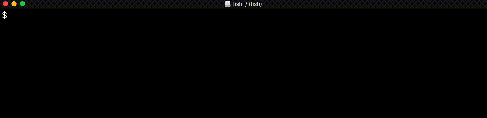

> **This documentation is outdated, based on the original readme from 1 October 2018!**

<p align="center"></p>

<h1 align="center">MarkDown++</h1>

<div align="center">
  <a href="https://twitter.com/intent/tweet?via=markdownppme&url=https://github.com/markdownpp/markdownpp/&text=What%20do%20you%20want%20to%20say%20to%20me?&hashtags=happyMarkDown++">
    
  </a>
</div>
<div align="center">
  <strong>:high_brightness:Editor de Markdown next-gen:crescent_moon:</strong>
</div>
<div align="center">
  Una aplicación hecha en <code>Electron</code> disponible para OS X, Windows y Linux
</div>

<br />

<div align="center">
  <!-- Version -->
  <a href="https://markdownpp.github.io/website">
    
  </a>
  <!-- License -->
  <a href="https://markdownpp.github.io/website">
    
  </a>
  <!-- Build Status -->
  <a href="https://markdownpp.github.io/website">
    
  </a>
  <!-- Downloads total -->
  <a href="https://markdownpp.github.io/website">
    
  </a>
  <!-- Downloads latest release -->
  <a href="https://markdownpp.github.io/website">
    
  </a>
  <!-- deps -->
  <a href="https://markdownpp.github.io/website">
    
  </a>
  <!-- sponsors -->
  <a href="https://opencollective.com/markdownpp">
    
  </a>
</div>

<div align="center">
  <h3>
    <a href="https://markdownpp.github.io/website">
      Página web
    </a>
    <span> | </span>
    <a href="https://github.com/markdownpp/markdownpp#features">
      Funcionalidades
    </a>
    <span> | </span>
    <a href="https://github.com/markdownpp/markdownpp#download-and-installation">
      Descargas
    </a>
    <span> | </span>
    <a href="https://github.com/markdownpp/markdownpp#development">
      Desarrollo
    </a>
    <span> | </span>
    <a href="https://github.com/markdownpp/markdownpp#contribution">
      Contribuciones
    </a>
  </h3>
</div>

<div align="center">
  <sub>Editor escrito con ❤︎ por
    <a href="https://github.com/Jocs">Jocs</a> y
    <a href="https://github.com/markdownpp/markdownpp/graphs/contributors">
      contribuidores
    </a>
  </sub>
</div>

<br />


## Características

- Renderizado en tiempo real, y utiliza [snabbdom](https://github.com/snabbdom/snabbdom) como motor de renderizado.
- Soporta [CommonMark Spec](https://spec.commonmark.org/0.29/) y [GitHub Flavored Markdown Spec](https://github.github.com/gfm/).
- Soporta párrafos y atajos en mitad de la línea para mejorar la eficiencia de escritura
- Exporta archivos markdown en **HTML** y **PDF**.
- Temas claro y oscuro.
- Varios modos de edición: **Modo código fuente**, **Modo máquina de escribir**, **Modo concentración**.

<h4 align="center">:crescent_moon:Temas claro y oscuro:high_brightness:</h4>

| Oscuro :crescent_moon:                                               | Claro :high_brightness:                                             |
|:------------------------------------------------------------------:|:-------------------------------------------------------------------:|
|  |  |

<h4 align="center">:smile_cat:Mode d'édition:dog:</h4>

| Código fuente                                                          | Máquina de escribir                                                               | Concentración                                                               |
|:--------------------------------------------------------------------:|:------------------------------------------------------------------------:|:-------------------------------------------------------------------:|
|  |  |  |

## ¿Por qué hacer otro editor ?

1. Me encanta escribir. He usado un montón de editores de markdown, y todavía no he encontrado ninguno que cumpla todas mis necesidades. No me gusta que me moleste ningún bug cuando escribo. **MarkDown++** usa virtual DOM para renderizar páginas, la cual tiene el beneficio de ser muy eficiente y de código abierto. Así, a cualquiera que le guste escribir y use markdown puede usar MarkDown++
2. Como se ha mencionado arriba, **MarkDown++** es de código abierto, y lo será para siempre. Esperamos que todos los amantes de markdown contribuyan y ayuden al desarrollo de **MarkDown++**, para que sea popular.
3. Hay muchos editores de markdown, y todos tienen sus méritos. Algunos tienen funcionalidades que otros no. Es difícil satisfacer los gustos de todo el mundo, pero esperamos que **MarkDown++** cubra las necesidades de todos lo máximo posible. Aunque lo último de **MarkDown++** no sea perfecto, lo damos todo para intentar que sea lo mejor

## Descarga e instalación


|                                                                                                              |                                                                                                                      |                                                                                                                                    |
|:-------------------------------------------------------------------------------------------------------------------------------------------------------------------------------------------------:|:-------------------------------------------------------------------------------------------------------------------------------------------------------------------------------------------------------------:|:-------------------------------------------------------------------------------------------------------------------------------------------------------------------------------------------------------------------------:|
| [](https://github.com/markdownpp/markdownpp/releases/download/v0.17.1/markdownpp-x64.dmg) | [](https://github.com/markdownpp/markdownpp/releases/download/v0.17.1/markdownpp-setup.exe) | [](https://github.com/markdownpp/markdownpp/releases/download/v0.17.1/markdownpp-x86_64.AppImage) |

¿No encuentras tu sistema? Ve a la [página de descargas](https://github.com/markdownpp/markdownpp/releases). ¿No se encuentra disponible tu versión? Abre una [issue](https://github.com/markdownpp/markdownpp/issues).

¿Quieres saber las nuevas funcionalidades de la última versión? Échale un vistazo al [CHANGELOG](../../.github/CHANGELOG.md)

Si estás usando macOS, puedes instalar Mart Text usando [**homebrew cask**](https://github.com/caskroom/homebrew-cask). Para usar Homebrew-Cask, tienes que tener instalado [Homebrew](https://brew.sh/)
```bash
brew install --cask mark-text
```



#### macOS y Windows

Descarga e instala Mart Text a partir del asistente de instalación

#### Linux

Sigue las [instrucciones de instalación de Linux]	(../../docs/LINUX.md).

## Desarrollo

Si quieres construir tú mismo **MarkDown++**, por favor, sigue las  [instrucciones de desarrollo](../../CONTRIBUTING.md#build-instructions).

Si tienes dudas sobre **MarkDown++**, puedes abrir un issue. Si lo haces, por favor, sigue el formato estándar. Por supuesto, apreciamos que mandes directamente un Pull Request

## Integración
- [Alfred Workflow](http://www.packal.org/workflow/mark-text): un workflow  para la aplicación de macOS Alfred: usa "mt" para abrir archivos/carpetas con MarkDown++
## Contribución

**MarkDown++** está en pleno desarrollo. Asegúrate de leer [la guía de contribución](../../CONTRIBUTING.md) antes de hacer un Pull Request. ¿Quieres añadir algunas funcionalidades? Échale un vistazo a la [TODO LIST](../../.github/TODOLIST.md) y abre issues.

## Backers

¡Gracias a todos nuestros colaboradores! 🙏 [[Conviértete en un backer](https://opencollective.com/markdownpp#backers)]

<a href="https://opencollective.com/markdownpp#backers" target="_blank"></a>

## Sponsors

Apoya este proyecto convirtiéndote en un sponsor. Tu logo se verá aquí con un link a tu página [[Conviértete en un sponsor](https://opencollective.com/markdownpp#silver-sponsors)]

**Bronze Sponsors**

<a href="https://opencollective.com/markdownpp#platinum-sponsors">
  
</a>

**Silver Sponsors**

<a href="https://opencollective.com/markdownpp#platinum-sponsors">
  
</a>

**Gold Sponsors**

<a href="https://opencollective.com/markdownpp#platinum-sponsors">
  
</a>

**Platinum Sponsors**

<a href="https://readme.io" target="_blank"></a>


## Contribuidores

Gracias a todo el mundo que ha contribuido al desarrollo de MarkDown++! [[contributors](https://github.com/markdownpp/markdownpp/graphs/contributors)]

Un especial agradecimiento a @[Yasujizr](https://github.com/Yasujizr) por hacer el logo de MarkDown++.

<a href="https://github.com/markdownpp/markdownpp/graphs/contributors"></a>

## Licencia

[**MIT**](../../LICENSE).

[](https://app.fossa.io/projects/git%2Bgithub.com%2Fmarkdownpp%2Fmarkdownpp?ref=badge_large)
